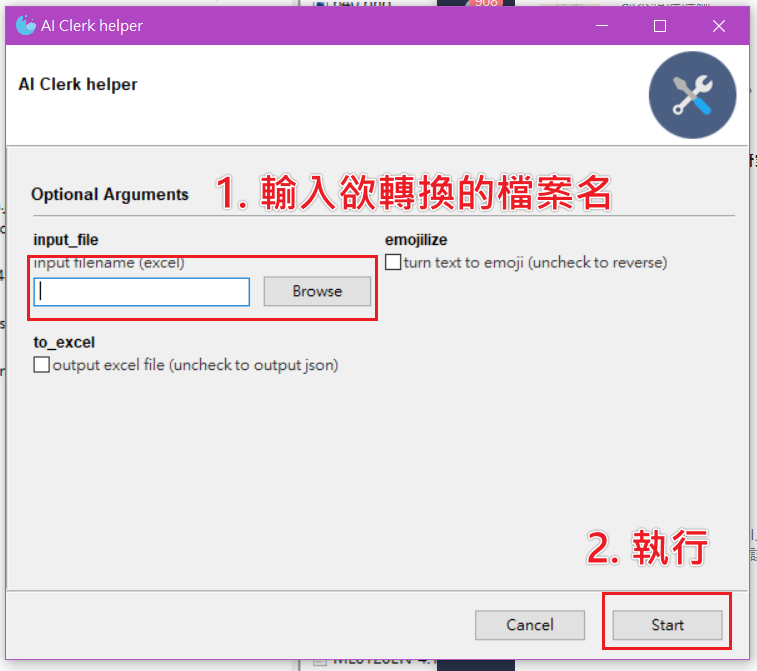

# AI Cleark Helper

## setup

- [chriskiehl/GooeyExamples: Example programs to Demonstrate Gooey's functionality](https://github.com/chriskiehl/GooeyExamples)

### Installation Instructions

Navigate the directory where you cloned the repo and pip install the dependencies

Create conda env
```
conda create --name AI_Clerk_helper python=3.6

conda activate AI_Clerk_helper
```

must first install wxpython before Gooey to avoid strange error
[Installation via pip fails needing pathlib2 · Issue #474 · chriskiehl/Gooey](https://github.com/chriskiehl/Gooey/issues/474)
```
conda install wxpython
conda install -c conda-forge gooey

pip install -r project_requirements.txt
pip install -r requirements.txt
```

### Running the examples

```
python AIClerk_helper.py
```

## packaging

- [Gooey/Packaging-Gooey.md at master · chriskiehl/Gooey](https://github.com/chriskiehl/Gooey/blob/master/docs/packaging/Packaging-Gooey.md)


Packing Gooey into a standalone executable is super straight forward thanks to PyInstaller. It is the only dependency you'll need and can be installed via the following.
```
pip install pyinstaller==3.5
```

### Running the .spec file

From the command line, run

```
pyinstaller -F --windowed build-win.spec

```

-   `-F` tells PyInstaller to create a single bundled output file
-   `--windowed` disables the terminal which would otherwise launch when you opened your app.

And that's it. Inside of the `dist/` directory, you'll find a beautiful stand-alone executable that you can distribute to your users.


## build window binary under linux

add wine apt repository [Ubuntu - WineHQ Wiki](https://wiki.winehq.org/Ubuntu)
```
sudo dpkg --add-architecture i386
wget -O - https://dl.winehq.org/wine-builds/winehq.key | sudo apt-key add -
sudo add-apt-repository 'deb https://dl.winehq.org/wine-builds/ubuntu/ bionic main'
```

Install unmet dependence: `faudio`
```
sudo add-apt-repository ppa:cybermax-dexter/sdl2-backport
```

install wine 5.9
[How to Install Wine Devel 4.8 in Ubuntu 19.04 / 18.04 | UbuntuHandbook](http://ubuntuhandbook.org/index.php/2019/05/nstall-wine-4-8-ubuntu-19-04-18-04/)
```
sudo apt install --install-recommends winehq-devel
```

install wxpython, gooey, pyinstaller and other requirements
```
pip install wxpython
pip install -c conda-forge gooey
pip install -r project_requirements.txt
pip install pyinstaller==3.5
```

build excutable
```
wine pyinstaller -F --windowed build-win.spec
```

debug mode [Using PyInstaller — PyInstaller 3.6 documentation](https://pyinstaller.readthedocs.io/en/stable/usage.html#how-to-generate)
```
wine pyinstaller -F --windowed build-win.spec -d bootloader
```

run on windows:
```
wine AI_Clerk_helper.exe
```




## issue

### [setuptools 45.0.0 may cause PyInstaller 3.3 packaged executable fail to launch · Issue #1963 · pypa/setuptools](https://github.com/pypa/setuptools/issues/1963)

Fixed by adding a hidden import:
```
a = Analysis(...,
             hiddenimports=['pkg_resources.py2_warn'],
             ...)
```

### INTERNAL ERROR: cannot create temporary directory!


maybe the problem of pyinstaller under wine...

- [PyInstaller 3.6 breaks WINE compatibility when using onefile · Issue #4628 · pyinstaller/pyinstaller](https://github.com/pyinstaller/pyinstaller/issues/4628)

Just downgrade to pyinstaller 3.5 anything works fine, no matter on Wine or on Windows.

